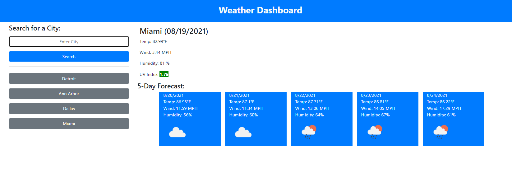

# Weather Dashboard

Description
------------

Webpage that allows you to search the weather of cities around the world. The site uses two Openweathermap apis to pull in current weather along with pulling a five day forecast. The site stores past searches in local storage and allows you to re-search those cities with just a click.

The site can be seen using the following URLs: 

* https://kjphelps90.github.io/weather-dashboard/

Author(s)
------------

* HTML, CSS, Javascript - Kevin Phelps

Version history
------------

0.1 - Inital Release

Preview
------------

